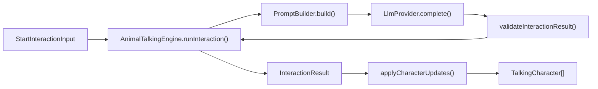
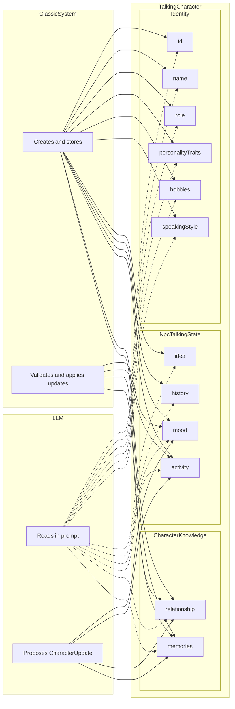
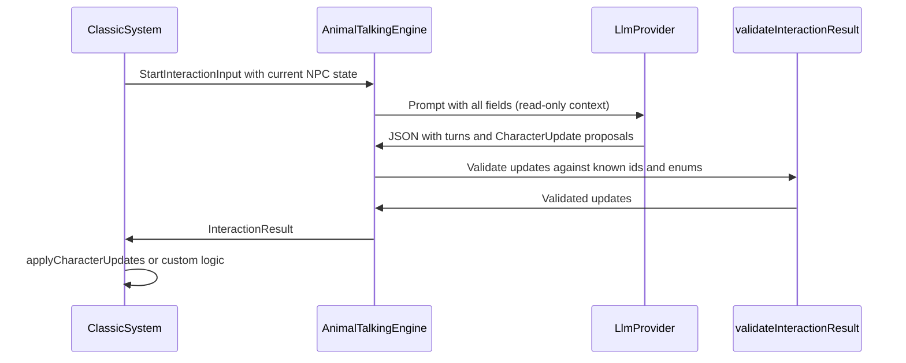

# Interface Contract — `animal-talking-core`

This document is the **normative interface contract** for `animal-talking-core` (v0.1.0).
It defines the types, invariants, validation rules, and behavioral guarantees that integrators can rely on.

For usage examples and integration patterns, see the [README](../README.md).

---

## Table of contents

- [1. Contract overview](#1-contract-overview)
- [2. Input types](#2-input-types)
- [2.1. Data ownership — who reads and writes each field](#21-data-ownership--who-reads-and-writes-each-field)
- [3. Output types](#3-output-types)
- [4. LlmProvider contract](#4-llmprovider-contract)
- [5. Validation rules](#5-validation-rules)
- [6. Behavioral guarantees (invariants)](#6-behavioral-guarantees-invariants)
- [7. Error codes](#7-error-codes)
- [8. Enumerations](#8-enumerations)
- [9. Engine progress phases](#9-engine-progress-phases)
- [10. Public exports](#10-public-exports)

---

## 1. Contract overview

`animal-talking-core` is a runtime-agnostic TypeScript library that sits between a **host simulation** and an **LLM provider**.
The host owns world state, triggers, rendering, and persistence.
The package owns prompt construction, provider orchestration, JSON parsing, and strict validation.

### Data flow



| Step | Component | Deterministic? | Responsibility |
|------|-----------|----------------|----------------|
| 1 | Host | yes | Builds `StartInteractionInput` from simulation state |
| 2 | `PromptBuilder` | yes | Serializes context into LLM messages |
| 3 | `LlmProvider` | no (async) | Returns raw JSON text |
| 4 | `validateInteractionResult` | yes | Parses, validates, normalizes provider output |
| 5 | `AnimalTalkingEngine` | yes | Returns `InteractionResult` (never throws) |
| 6 | `applyCharacterUpdates` | yes | Applies validated updates immutably (optional) |

### Boundary of responsibility

| Owned by host | Owned by package |
|---------------|------------------|
| World loop, proximity, triggers, cooldowns | Prompt building |
| Rendering and UI | LLM call orchestration |
| Persistence and history | JSON parsing and validation |
| When to call `runInteraction()` | Structured dialogue and update output |
| Applying updates to its own store | `applyCharacterUpdates()` helper |

---

## 2. Input types

All input types are exported from `animal-talking-core` and must be provided by the host before each interaction.

### `StartInteractionInput`

Top-level contract for one interaction request.

```ts
interface StartInteractionInput {
  interactionId: string;           // required — unique id for this interaction
  participants: TalkingCharacter[]; // required — at least one participant expected by host
  worldContext: WorldContext;       // required
  interactionContext: InteractionContext; // required
  maxTurns?: number;                // optional — default: 6
}
```

| Field | Required | Constraints |
|-------|----------|-------------|
| `interactionId` | yes | Non-empty string; echoed in `InteractionResult` |
| `participants` | yes | Array of `TalkingCharacter`; ids must be unique within the array |
| `worldContext` | yes | See [WorldContext](#worldcontext) |
| `interactionContext` | yes | See [InteractionContext](#interactioncontext) |
| `maxTurns` | no | Default `6`; caps validated turn count in provider output |

### `TalkingCharacter`

Identity and runtime talking state for one NPC.

```ts
interface TalkingCharacter {
  id: string;                      // required — stable identifier
  name: string;                    // required — display name; used to fill speakerName
  role?: string;                   // optional — sent to LLM context
  personalityTraits?: string[];    // optional — sent to LLM context
  hobbies?: string[];                // optional — sent to LLM context
  speakingStyle?: string;          // optional — sent to LLM context
  talkingState: NpcTalkingState;   // required
}
```

### `NpcTalkingState`

Current mental/social state of a character during an interaction.

```ts
interface NpcTalkingState {
  idea: string;                              // required — current thought/intent
  activity: NpcActivity | null;            // required — current world activity or null
  history: string;                           // required — background summary
  mood: Mood;                                // required — see [Mood](#mood)
  knowledge: Record<string, CharacterKnowledge>; // required — keyed by targetCharacterId
  objectives: NpcObjective[];                          // required — dynamic objectives; may be empty
}
```

### `CharacterKnowledge`

What one character knows about another.

```ts
interface CharacterKnowledge {
  targetCharacterId: string;       // required — must match map key
  memories: MemoryEntry[];         // required — may be empty
  relationship: RelationshipType;  // required — see [RelationshipType](#relationshiptype)
}
```

### `MemoryEntry`

```ts
interface MemoryEntry {
  id: string;           // required in stored state; auto-generated on ADD_MEMORY if omitted
  content: string;      // required
  createdAt: string;    // required in stored state; ISO 8601 recommended
}
```

### `NpcActivity`

Discriminated union for character world activities.

```ts
type NpcActivity =
  | { type: "GO_TO_LOCATION"; targetZoneId: string }
  | { type: "TALK_TO_CHARACTER"; targetCharacterId: string }
  | { type: "IDLE" };
```

When validating provider output, `targetZoneId` must reference a zone in `worldContext.zones`, and `targetCharacterId` must reference a participant id.

### `NpcObjective`

Tracked narrative objective with lifecycle.

```ts
interface NpcObjective {
  id: string;
  description: string;
  status: "active" | "fulfilled";
}
```

Lives in `talkingState.objectives: NpcObjective[]`. The host decides when to archive or clear fulfilled objectives.

### `WorldContext`

Environmental context passed into the prompt.

```ts
interface WorldContext {
  time: WorldTime;
  weather: Weather;
  zones: WorldZone[];
}

interface WorldTime {
  day: number;
  hour: number;
  minute: number;
}

interface WorldZone {
  id: string;
  name: string;
  description?: string;
}
```

The zone matching `interactionContext.locationZoneId` is included as `locationZone` in the prompt payload.

### `InteractionContext`

Why and where the interaction happens.

```ts
interface InteractionContext {
  locationZoneId: string | null;   // null allowed; resolved against worldContext.zones
  reason: InteractionReason;       // see [InteractionReason](#interactionreason)
}
```

---

## 2.1. Data ownership — who reads and writes each field

This section describes the **pure NPC data model** (`TalkingCharacter`) and which actor owns each field:
the **classic simulation system** (host), the **LLM**, or **both**.

### Ownership categories

| Tag | Meaning |
|-----|---------|
| `[S]` | **Classic system only** — the host creates, stores, and modifies this field |
| `[R]` | **LLM read-only** — sent in the prompt for context; never returned as a direct modification |
| `[S+L]` | **Shared** — the LLM **proposes** a new value via a `CharacterUpdate`; the classic system **validates and applies** it |

A field tagged `[S]` + `[R]` means the host owns writes while the LLM only reads it during an interaction.

### NPC data schema



Solid arrows (`-->`) represent write or apply paths.
Dotted arrows (`-.->`) represent read-only access in the prompt.

### Field-by-field ownership

| Group | Field | Category | Update type |
|-------|-------|----------|-------------|
| Identity | `id` | `[S]` + `[R]` | — |
| Identity | `name` | `[S]` + `[R]` | — |
| Identity | `role` | `[S]` + `[R]` | — |
| Identity | `personalityTraits` | `[S]` + `[R]` | — |
| Identity | `hobbies` | `[S]` + `[R]` | — |
| Identity | `speakingStyle` | `[S]` + `[R]` | — |
| TalkingState | `idea` | `[S]` + `[R]` | — |
| TalkingState | `history` | `[S+L]` | `APPEND_HISTORY` |
| TalkingState | `mood` | `[S+L]` | `UPDATE_MOOD` |
| TalkingState | `activity` | `[S+L]` | `UPDATE_ACTIVITY` |
| TalkingState | `objectives[]` | `[S+L]` | `ADD_OBJECTIVE`, `FULFILL_OBJECTIVE` |
| Knowledge | `relationship` | `[S+L]` | `UPDATE_RELATIONSHIP` |
| Knowledge | `memories[]` | `[S+L]` | `ADD_MEMORY` |

### Summary by actor

| Actor | Reads | Writes directly | Proposes via update |
|-------|-------|-----------------|---------------------|
| Classic system | All fields | All fields | — |
| LLM | All fields in prompt | Never | `mood`, `activity`, `history` (append), `objectives[]`, `relationship`, `memories[]` |
| Package | Provider JSON | Never | Validates proposed updates only |

Identity fields and the `idea` field are **never modified by the LLM**.
They shape dialogue generation but remain under full host control.

`history` is **appended** (never replaced) — the LLM adds a one-sentence summary at the end.
`objectives` has a lifecycle: `ADD_OBJECTIVE` creates an active objective; `FULFILL_OBJECTIVE` marks it fulfilled. Only active objectives are sent in the prompt.

### Shared update flow (`[S+L]` fields)

For fields in the `[S+L]` category, the LLM never mutates host state directly:

1. The LLM returns a `CharacterUpdate` in the provider JSON (`updates` array).
2. The package validates the update (known ids, allowed enums, strict shapes).
3. On success, the host applies the update via `applyCharacterUpdates()` or its own store logic.
4. The host may **reject or filter** an update before application (e.g. cap memory count, block mood swings).



---

## 3. Output types

### `InteractionResult`

Returned by `AnimalTalkingEngine.runInteraction()`. **Never throws.**

```ts
interface InteractionResult {
  interactionId: string;
  status: "completed" | "failed";
  turns: DialogueTurn[];
  updates: CharacterUpdate[];
  error?: InteractionErrorSummary;
  rawResponse?: string;
}
```

| Field | When present | Semantics |
|-------|--------------|-----------|
| `status: "completed"` | Validation succeeded | `turns` and `updates` contain validated data |
| `status: "failed"` | Any step failed | `turns` and `updates` are **always empty arrays** |
| `error` | `status === "failed"` | Summary with `code`, `message`, optional `details` |
| `rawResponse` | Provider returned text | Original provider text; present on JSON/validation failures and on success |

### `DialogueTurn`

Normalized dialogue line. Provider output is enriched during validation.

```ts
interface DialogueTurn {
  index: number;        // non-negative integer from provider
  speakerId: string;    // must reference a participant
  speakerName: string;  // auto-filled from participant.name (fallback: speakerId)
  message: string;      // trimmed, whitespace-collapsed
  mood?: Mood;          // optional; validated against Mood enum when present
  createdAt: string;    // auto-generated ISO 8601 timestamp at validation time
}
```

**Provider input shape** (before normalization):

```ts
{ index: number; speakerId: string; message: string; mood?: string }
```

Fields `speakerName` and `createdAt` are **not accepted** from the provider; they are always set by the validator.

### `CharacterUpdate`

Discriminated union of structured state mutations. All four types are validated strictly.

#### `UPDATE_MOOD`

```ts
{ type: "UPDATE_MOOD"; characterId: string; mood: Mood }
```

Allowed keys: `type`, `characterId`, `mood`.

#### `UPDATE_ACTIVITY`

```ts
{ type: "UPDATE_ACTIVITY"; characterId: string; activity: NpcActivity | null }
```

Allowed keys: `type`, `characterId`, `activity`.

#### `ADD_MEMORY`

```ts
{
  type: "ADD_MEMORY";
  characterId: string;
  targetCharacterId: string;
  memory: MemoryEntry;
}
```

Allowed keys: `type`, `characterId`, `targetCharacterId`, `memory`.

Provider memory shape:

```ts
{ id?: string; content: string; createdAt?: string }
```

- `id`: generated as `memory_<timestamp>_<random>` if missing or empty
- `content`: trimmed and whitespace-collapsed
- `createdAt`: set to current ISO timestamp if missing or empty

#### `UPDATE_RELATIONSHIP`

```ts
{
  type: "UPDATE_RELATIONSHIP";
  characterId: string;
  targetCharacterId: string;
  relationship: RelationshipType;
}
```

Allowed keys: `type`, `characterId`, `targetCharacterId`, `relationship`.

#### `APPEND_HISTORY`

```ts
{
  type: "APPEND_HISTORY";
  characterId: string;
  summary: string;   // one concise sentence about the conversation
}
```

Allowed keys: `type`, `characterId`, `summary`. `summary` is trimmed and whitespace-collapsed.
Applied by appending to `talkingState.history` (never replaces the existing value).

#### `ADD_OBJECTIVE`

```ts
{
  type: "ADD_OBJECTIVE";
  characterId: string;
  objective: { id?: string; description: string };
}
```

Allowed keys on `objective`: `id`, `description`, `status`. `status` is **always forced to `"active"`** regardless of what the LLM sends. `id` is auto-generated if absent. `description` is trimmed and whitespace-collapsed.

#### `FULFILL_OBJECTIVE`

```ts
{
  type: "FULFILL_OBJECTIVE";
  characterId: string;
  objectiveId: string;
}
```

Allowed keys: `type`, `characterId`, `objectiveId`. Silently skipped if `objectiveId` does not match any existing objective. Only active objectives are sent to the LLM in the prompt.

### `InteractionErrorSummary`

```ts
interface InteractionErrorSummary {
  code: string;
  message: string;
  details?: unknown;
}
```

When validation fails, `details` may contain an `InteractionValidationError` with an `issues` array.

### `ValidationResult<T>`

Returned by `validateInteractionResult()` for manual validation.

```ts
type ValidationResult<T> =
  | { ok: true; value: T }
  | { ok: false; error: InteractionValidationError };
```

`ValidatedInteractionPayload`:

```ts
interface ValidatedInteractionPayload {
  turns: DialogueTurn[];
  updates: CharacterUpdate[];
}
```

---

## 4. LlmProvider contract

The package is provider-agnostic. The host injects any implementation of `LlmProvider`.

### Types

```ts
type LlmMessageRole = "system" | "user" | "assistant";

interface LlmMessage {
  role: LlmMessageRole;
  content: string;
}

interface LlmRequest {
  messages: LlmMessage[];
  temperature?: number;
  signal?: AbortSignal;
}

interface LlmResponse {
  text: string;
  raw?: unknown;
}

interface LlmProvider {
  complete(request: LlmRequest): Promise<LlmResponse>;
}
```

### Provider obligations

1. **`complete()` must return a Promise** resolving to `{ text: string }`.
2. **`text` must contain a JSON object** (not markdown-wrapped) with exactly two top-level keys: `turns` and `updates`.
3. **The engine passes two messages** by default: `system` (instructions) and `user` (serialized context).
4. **`temperature` and `signal` are optional** — the default engine call does not pass them; providers may ignore them.

### Expected JSON shape in `text`

```json
{
  "turns": [
    { "index": 0, "speakerId": "fox", "message": "Hello.", "mood": "CURIOUS" }
  ],
  "updates": [
    { "type": "UPDATE_MOOD", "characterId": "fox", "mood": "HAPPY" }
  ]
}
```

### Provider failure behavior

| Provider behavior | Engine result |
|-------------------|---------------|
| Throws or rejects | `status: "failed"`, code `provider_unavailable` |
| Exceeds `timeoutMs` | `status: "failed"`, code `provider_unavailable` (timeout message) |
| Returns non-JSON `text` | `status: "failed"`, code `invalid_json`, `rawResponse` set |
| Returns JSON failing validation | `status: "failed"`, code `validation_failed`, `rawResponse` set |
| Returns valid JSON | `status: "completed"`, `rawResponse` set |

The engine **never propagates provider exceptions** to the caller.

---

## 5. Validation rules

Every provider response goes through `validateInteractionResult()` before being returned as `completed`.

Validation context is built by `buildValidationContext(input)`:

- `participantIds`: Set of all `participants[].id`
- `participantNames`: Map id → name
- `zoneIds`: Set of all `worldContext.zones[].id`
- `maxTurns`: `input.maxTurns ?? 6`

### Top-level object

| Condition | Issue code | Result |
|-----------|------------|--------|
| Response is not a plain object | `invalid_object` | Rejected |
| Keys other than `turns`, `updates` | `invalid_object` | Rejected |
| `turns` is not an array | `invalid_object` | Rejected |
| `updates` is not an array | `invalid_object` | Rejected |
| `turns.length > maxTurns` | `too_many_items` | Rejected |

### Turn validation (`$.turns[n]`)

Allowed keys: `index`, `speakerId`, `message`, `mood`.

| Condition | Path | Issue code |
|-----------|------|------------|
| Not an object | `$.turns[n]` | `invalid_object` |
| Unexpected keys | `$.turns[n]` | `invalid_object` |
| `index` not a non-negative integer | `$.turns[n].index` | `invalid_number` |
| `speakerId` empty or not a string | `$.turns[n].speakerId` | `invalid_string` |
| `speakerId` not in participants | `$.turns[n].speakerId` | `invalid_string` |
| `message` empty or not a string | `$.turns[n].message` | `invalid_string` |
| `mood` present but not in Mood enum | `$.turns[n].mood` | `invalid_enum` |

### Update validation (`$.updates[n]`)

| Condition | Path | Issue code |
|-----------|------|------------|
| Not an object | `$.updates[n]` | `invalid_object` |
| Unknown `type` | `$.updates[n].type` | `invalid_enum` |
| Unexpected keys for update type | `$.updates[n]` | `invalid_object` |
| `characterId` not in participants | `$.updates[n].characterId` | `invalid_string` |
| `targetCharacterId` not in participants | `$.updates[n].targetCharacterId` | `invalid_string` |

#### `UPDATE_MOOD`

| Condition | Path | Issue code |
|-----------|------|------------|
| `mood` not in Mood enum | `$.updates[n].mood` | `invalid_enum` |

#### `UPDATE_ACTIVITY`

| Condition | Path | Issue code |
|-----------|------|------------|
| `activity` not object or null | `$.updates[n].activity` | `invalid_object` |
| Unexpected keys in activity | `$.updates[n].activity` | `invalid_object` |
| Invalid `activity.type` | `$.updates[n].activity.type` | `invalid_enum` |
| `GO_TO_LOCATION`: empty `targetZoneId` | `$.updates[n].activity.targetZoneId` | `invalid_string` |
| `GO_TO_LOCATION`: unknown zone | `$.updates[n].activity.targetZoneId` | `invalid_string` |
| `TALK_TO_CHARACTER`: empty `targetCharacterId` | `$.updates[n].activity.targetCharacterId` | `invalid_string` |
| `TALK_TO_CHARACTER`: unknown participant | `$.updates[n].activity.targetCharacterId` | `invalid_string` |

#### `ADD_MEMORY`

| Condition | Path | Issue code |
|-----------|------|------------|
| `memory` not an object | `$.updates[n].memory` | `invalid_object` |
| Unexpected keys in memory | `$.updates[n].memory` | `invalid_object` |
| Empty `memory.content` | `$.updates[n].memory.content` | `invalid_string` |

#### `UPDATE_RELATIONSHIP`

| Condition | Path | Issue code |
|-----------|------|------------|
| `relationship` not in RelationshipType enum | `$.updates[n].relationship` | `invalid_enum` |

#### `APPEND_HISTORY`

| Condition | Path | Issue code |
|-----------|------|------------|
| Unexpected keys | `$.updates[n]` | `invalid_object` |
| `summary` empty or not a string | `$.updates[n].summary` | `invalid_string` |

#### `ADD_OBJECTIVE`

| Condition | Path | Issue code |
|-----------|------|------------|
| Unexpected keys | `$.updates[n]` | `invalid_object` |
| `objective` not an object | `$.updates[n].objective` | `invalid_object` |
| Unexpected keys in `objective` | `$.updates[n].objective` | `invalid_object` |
| `objective.description` empty or not a string | `$.updates[n].objective.description` | `invalid_string` |

#### `FULFILL_OBJECTIVE`

| Condition | Path | Issue code |
|-----------|------|------------|
| Unexpected keys | `$.updates[n]` | `invalid_object` |
| `objectiveId` empty or not a string | `$.updates[n].objectiveId` | `invalid_string` |

### Normalization (applied on success)

| Field | Normalization |
|-------|---------------|
| `DialogueTurn.message` | Trim + collapse internal whitespace to single spaces |
| `DialogueTurn.speakerName` | Set from `participantNames.get(speakerId)` |
| `DialogueTurn.createdAt` | Set to `new Date().toISOString()` |
| `MemoryEntry.content` | Trim + collapse whitespace |
| `MemoryEntry.id` | Generated if missing/empty: `memory_<base36timestamp>_<random>` |
| `MemoryEntry.createdAt` | Set to ISO timestamp if missing/empty |
| `AppendHistory.summary` | Trim + collapse whitespace |
| `AddObjective.objective.description` | Trim + collapse whitespace |
| `AddObjective.objective.id` | Generated if missing/empty: `objective_<base36timestamp>_<random>` |
| `AddObjective.objective.status` | Always forced to `"active"` |
| `FulfillObjective.objectiveId` | Trimmed |

---

## 6. Behavioral guarantees (invariants)

These guarantees are part of the public contract.

### `AnimalTalkingEngine.runInteraction()`

- **Never throws.** All failures are expressed as `status: "failed"`.
- On failure, **`turns` and `updates` are always `[]`**.
- Does **not mutate** `StartInteractionInput` or participant objects.
- Does **not persist** anything.
- Calls `onProgress` in order when configured (see [section 9](#9-engine-progress-phases)).

### `applyCharacterUpdates(participants, updates)`

- Returns a **new array**; input `participants` is unchanged (deep clone via JSON).
- Updates are applied **in array order**.
- Unknown `characterId` values are **silently skipped** (no throw, no error).
- For `ADD_MEMORY` / `UPDATE_RELATIONSHIP` on unknown targets, creates a new `CharacterKnowledge` entry with default `RelationshipType.Stranger` if needed.
- `APPEND_HISTORY`: appends with a newline separator; no separator if `history` is currently empty.
- `FULFILL_OBJECTIVE`: silently skips if `objectiveId` is not found in `objectives`.
- `ADD_OBJECTIVE`: pushes the normalized objective (always `status: "active"`) to `objectives`.

### `PromptBuilder.build()`

- Pure function: same input context → same prompt output.
- Trims knowledge sent to LLM: default max 3 memories per target, max 4 knowledge targets (configurable).
- All LLM instructions and JSON field names remain in **English**.

### `validateInteractionResult()`

- Pure function: no side effects on host state.
- Can be used independently of the engine for testing or custom pipelines.

---

## 7. Error codes

### `AnimalTalkingErrorCode`

Defined on `AnimalTalkingError` and related classes:

| Code | Class | Trigger |
|------|-------|---------|
| `provider_unavailable` | `InteractionProviderError` | Provider throws, rejects, or is unreachable |
| `provider_unavailable` | `InteractionProviderError` | `timeoutMs` exceeded (message includes timeout duration) |
| `invalid_json` | `InteractionParseError` | `JSON.parse(response.text)` fails |
| `validation_failed` | `InteractionValidationError` | Provider JSON fails `validateInteractionResult()` |
| `configuration_error` | `AnimalTalkingError` | Reserved for configuration issues (not used by engine today) |

### `InteractionResult.error.code` mapping

When `runInteraction()` returns `status: "failed"`:

| Situation | Typical `error.code` |
|-----------|---------------------|
| Invalid JSON | `invalid_json` |
| Validation failure | `validation_failed` |
| Provider error / timeout | `provider_unavailable` |
| Other `Error` instances | `provider_unavailable` (fallback) |
| Non-Error thrown values | `provider_unavailable` (fallback) |

Validation errors include structured `issues` in `error.details` when the error is an `InteractionValidationError`:

```ts
interface ValidationIssue {
  path: string;   // JSON pointer style, e.g. "$.turns[0].speakerId"
  code: string;   // e.g. "invalid_string", "invalid_enum", "too_many_items"
  message: string;
}
```

---

## 8. Enumerations

All enum values are case-sensitive strings.

### `Mood`

```
NEUTRAL | HAPPY | SAD | CURIOUS | ANXIOUS | ANGRY
```

### `RelationshipType`

```
STRANGER | FRIEND | RIVAL | FAMILY | ROMANTIC_INTEREST
```

TypeScript enum: `RelationshipType.Stranger`, `RelationshipType.Friend`, etc.

### `Weather`

```
SUNNY | CLOUDY | RAINY | STORMY | SNOWY
```

### `InteractionReason`

```
PROXIMITY | SAME_ZONE | SCRIPTED_EVENT
```

### `CharacterUpdate.type`

```
UPDATE_MOOD | UPDATE_ACTIVITY | ADD_MEMORY | UPDATE_RELATIONSHIP | APPEND_HISTORY | ADD_OBJECTIVE | FULFILL_OBJECTIVE
```

### `NpcObjective.status`

```
active | fulfilled
```

### `NpcActivity.type`

```
GO_TO_LOCATION | TALK_TO_CHARACTER | IDLE
```

---

## 9. Engine progress phases

When `onProgress` is configured on `AnimalTalkingEngine`, events are emitted in this order on the happy path:

| Order | Phase | When |
|-------|-------|------|
| 1 | `prompt-built` | After `PromptBuilder.build()` |
| 2 | `provider-called` | Before `LlmProvider.complete()` |
| 3 | `response-received` | After provider resolves |
| 4 | `validated` | After successful validation |
| 5 | `completed` | Before returning `status: "completed"` |

```ts
interface EngineProgressEvent {
  phase: "prompt-built" | "provider-called" | "response-received" | "validated" | "completed";
  interactionId: string;
  message?: string;
}
```

On failure, phases 1–3 may have fired; **`validated` and `completed` are not emitted**.
No progress event is emitted for failure itself.

---

## 10. Public exports

Entry point: [`src/index.ts`](../src/index.ts) → `"animal-talking-core"`.

### Classes

| Export | Role |
|--------|------|
| `AnimalTalkingEngine` | Orchestrates one interaction end-to-end |
| `PromptBuilder` | Builds LLM messages from validation context |
| `AnimalTalkingError` | Base error class |
| `InteractionValidationError` | Validation failure with `issues[]` |
| `InteractionProviderError` | Provider/timeout failure |
| `InteractionParseError` | JSON parse failure |

### Functions

| Export | Role |
|--------|------|
| `applyCharacterUpdates` | Immutable application of `CharacterUpdate[]` |
| `validateInteractionResult` | Validates raw provider JSON |
| `buildValidationContext` | Builds context from `StartInteractionInput` |

### Schema helpers (from `interactionSchemas`)

| Export | Role |
|--------|------|
| `characterUpdateTypes` | Allowed update type strings |
| `moods` | Allowed mood values |
| `relationshipTypes` | Allowed relationship values |
| `activityTypes` | Allowed activity type strings |
| `interactionReasons` | Allowed interaction reasons |
| `weatherTypes` | Allowed weather values |
| `isRecord`, `hasOnlyKeys` | Type guards for validation |
| `stringIssue`, `enumIssue`, `objectIssue` | Issue builders |

### Type exports

All types from `types/`: `TalkingCharacter`, `NpcTalkingState`, `DialogueTurn`, `CharacterUpdate`, `StartInteractionInput`, `InteractionResult`, `WorldContext`, `LlmProvider`, `LlmRequest`, `LlmResponse`, `LlmMessage`, and others.

---

## Version

This contract documents **`animal-talking-core` v0.1.0**.
Breaking changes to these types, validation rules, or invariants require a semver major bump.
